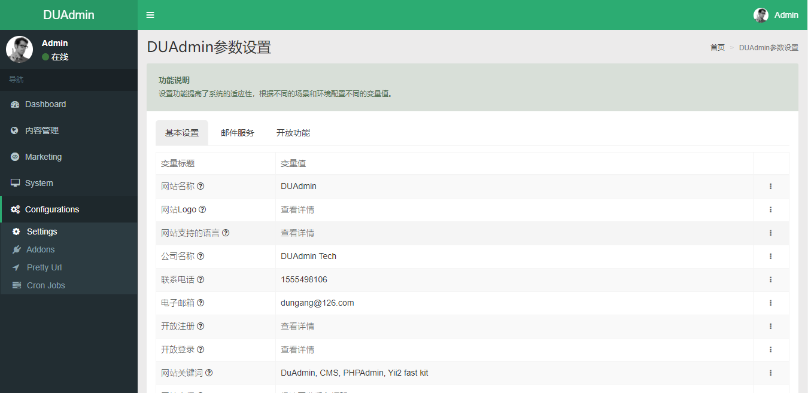

# DUAdmin 达柚管理后台

DUAdmin （中文：达柚管理后台） 是一个管理后台快速开发框架，基于Yii2框架开发。Du是独的发音，独角兽的意思，我们更多想表达的意思是，希望是使用我们的后台程序的公司，以后都都能成为独角兽 ^^!

## 项目状态

**开发中**

## 特点

- **代码生成更强大** 约定大于配置，在Yii2 generator的基础上增加和修改了更加强大的代码生成功能，包括高级搜索支持时间段查询，自动生成模糊查询所有字符串类型的字段。 
- **不仅只是PJAX** 在DuAdmin的管理后台，完美结合了pjax和bootstrap的modal,表单提交成功后可以支持局部刷新列表。
- **更丰富的列表显示** 包装了Adminlte Panel的GridView和TreeGridView,TreeSortableList.更加优美的ActionColumn小部件。
- **RBAC权限管理更直观** 基于YII2-RBAC，在不丢失强大功能的基因的基础上，更加合理的规划权限、角色和规则的组织结构，呈现了最直观的管理方式
- **国际化** 更加清晰的国际化消息分类文件规划，分类文件全部有DuAdmin自动关联，延迟加载。更加诱人的是使用generator根据表的注解生成翻译。多语言管理组件的支持，可以快速开发多语言的内容，比如：CMS
- **API开发** DuAdmin在设计之初就考虑了3个入口，管理后台，会员后台，API的功能,通过代码工具快速生成API代码
- **模块化插件** 插件是在module的基础上开发，解决插件前后端的控制器不被交叉范围的问题。插件可以有自己的vendor，只需要简单的配置即可完成插件的配置功能。
- **丰富的数据迁移** 一键管理前端后端包括插件的数据迁移文件。交互的数据迁移管理，最大化减少开发者输入负载的别名和路径。
- **HOOK机制** 支持前后端，插件的hook注册，也可以实现异步（开发中）
- **WEBPACK.MIX.JS** DuAdmin做了定制开发，可以在前后端，包括插件内部编辑js、less源码，而不用在一个src下开发所有功能的资源文件。大大提高了代码管理效率。每个插件都应该有自己的资源文件，而不是跟总项目混在一起。
- **可定制前端首页** 简单的管理前端首页的内容，通过PageBlock管理，前端，插件提供的块，动态生成前端首页。功能比较基础，但是满足一般的场景。 
- **POWERED BY YII2** Yii is a high-performance PHP framework best for developing Web 2.0 applications.

## 安装步骤

* 下载后台框架代码
```bash
git clone https://gitee.com/dungang/DuAdmin.git DuAdmin
或
git clone https://github.com/dungang/DuAdmin.git DuAdmin

cd DuAdmin
composer --prefer-dist install

## 如果没有出现runtime目录，在运行一下
composer install

cp .env.example .env

## 先在自己的数据库中创建一个空数据库，比如duadmin
## 修改.env，配置数据库
vim .env

DB_CONNECTION=mysql
DB_HOST=localhost
DB_PORT=3306
DB_DATABASE=duadmin
DB_USERNAME=root
DB_PASSWORD=

## 初始化

> 最后根据提示输入管理员账户，密码，邮箱

php yii  init


php yii dua-serve

```

前端地址: http://localhost:8080/
后端地址: http://localhost:8080/admin.php

## 部分截图

#### 前端登录


#### 前端首页


#### 前端功能

 
#### 前端联系 


#### 前端首页


#### 后端设置管理


#### 后端菜单管理


#### 后端内容管理


#### 后端首页管理


#### 代码生成器


## 特别鸣谢
感谢以下的项目,排名不分先后

- yii2 https://www.yiiframework.com
- fontawesome http://www.fontawesome.com.cn/faicons/
- Jquery http://jquery.com
- bootstrap http://getbootstrap.com
- AdminLTE https://adminlte.io
- Webpack.mix.js

## 版权信息

DUAdmin遵循Apache2开源协议发布，并提供免费使用。

本项目包含的第三方源码和二进制文件之版权信息另行标注。

版权所有 DUAdmin (http://www.duadmin.com)

All rights reserved。
